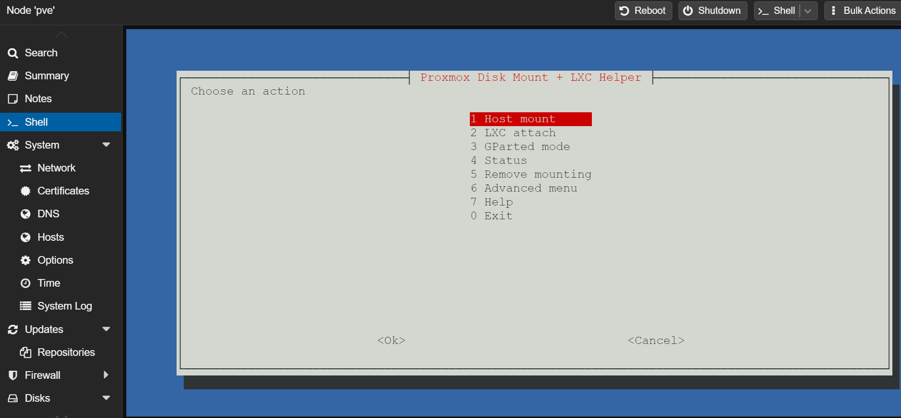

<p align="center">
  
  </a>
  
  
  
</p>

# Proxmox Intel Iris Xe SR-IOV vGPU Helper

Enable, validate, rollback Intel SR-IOV vGPU on Proxmox VE (GRUB hosts).

`proxmox-disk-mount-helper.sh` for Proxmox VE:

- host disk mount
- LXC bind mount attach/remove
- CLI GParted-style disk editor

Repository:

- Main repo: `https://github.com/vadlike/proxmox-helper-script`
- Reference example: `https://github.com/vadlike/proxmox-intel-vgpu-installer`

## Screenshot

<p align="center">
  
</p>

## Quick Install

### wget

```bash
wget -O proxmox-disk-mount-helper.sh https://raw.githubusercontent.com/vadlike/proxmox-helper-script/main/proxmox-disk-mount-helper.sh && chmod +x proxmox-disk-mount-helper.sh && ./proxmox-disk-mount-helper.sh
```

### curl

```bash
curl -fsSL -o proxmox-disk-mount-helper.sh https://raw.githubusercontent.com/vadlike/proxmox-helper-script/main/proxmox-disk-mount-helper.sh && chmod +x proxmox-disk-mount-helper.sh && ./proxmox-disk-mount-helper.sh
```

## Run Local Copy

```bash
chmod +x ./proxmox-disk-mount-helper.sh
./proxmox-disk-mount-helper.sh
```
